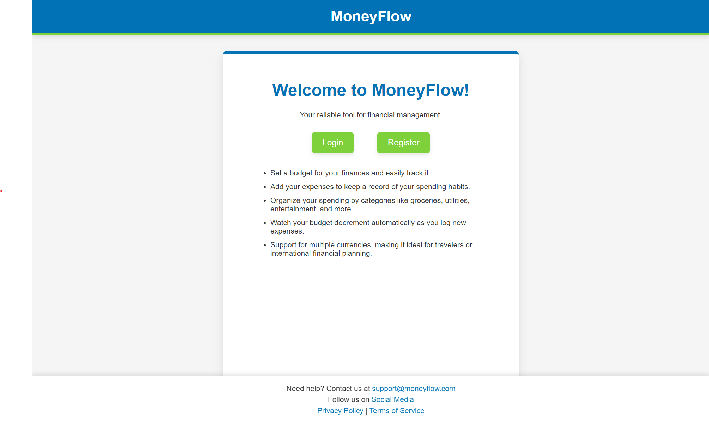
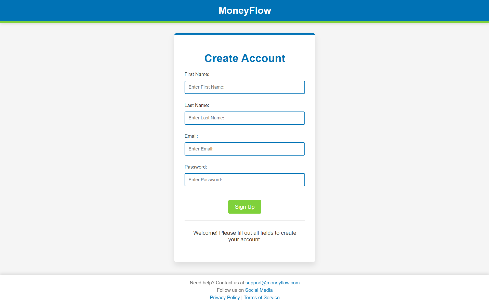
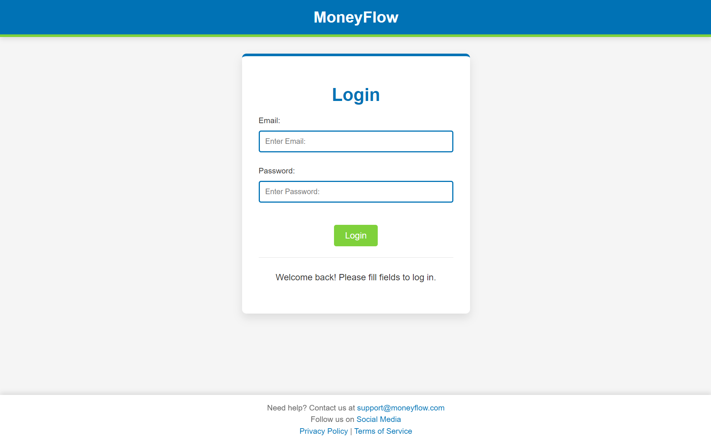
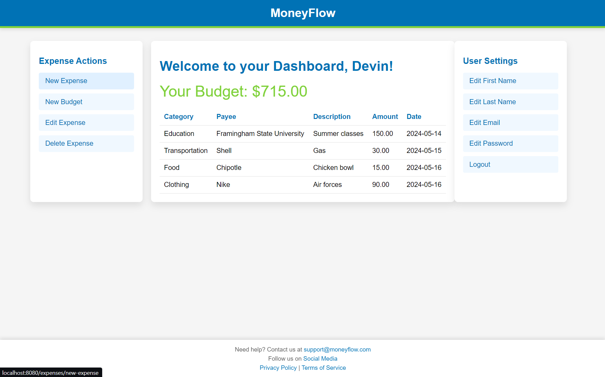

# MoneyFlow

MoneyFlow is a full-stack web application designed to help users manage their personal finances by tracking expenses and setting budgets. This project was developed to enhance my skills in full-stack development, utilizing a variety of modern technologies and frameworks.

## Table of Contents

- [Motivation](#motivation)
- [Features](#features)
- [Technologies Used](#technologies-used)
- [Screenshots](#screenshots)

## Motivation

As a computer science student, I am constantly looking for ways to improve my full-stack development skills. The idea behind MoneyFlow was to create a practical application that not only helps users manage their finances but also allows me to gain hands-on experience with various technologies. This project provided an excellent opportunity to work with Spring Boot for backend development, Thymeleaf for server-side templating, and CSS and JavaScript for front-end design and interactivity.

## Features

- **User Registration and Authentication**: Users can create accounts, log in, and manage their profiles.
- **Expense Tracking**: Users can add, edit, and delete expenses, categorized by various criteria.
- **Budget Management**: Users can set and update their budget, which is dynamically displayed on the dashboard.
- **Responsive Design**: The application is designed to be responsive, providing a seamless experience across different devices.
- **Interactive Dashboard**: Users can view their expenses and budget on a user-friendly dashboard.

## Technologies Used

- **Spring Boot**: For building the backend RESTful API and handling business logic.
- **Thymeleaf**: For server-side rendering and dynamic content generation.
- **CSS**: For styling the application and ensuring a responsive design.
- **JavaScript**: For client-side interactivity and validation.
- **HTML**: For structuring the web pages.

## Screenshots

